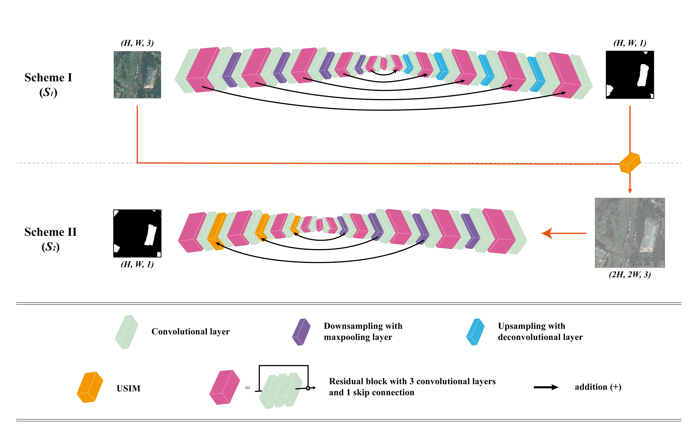
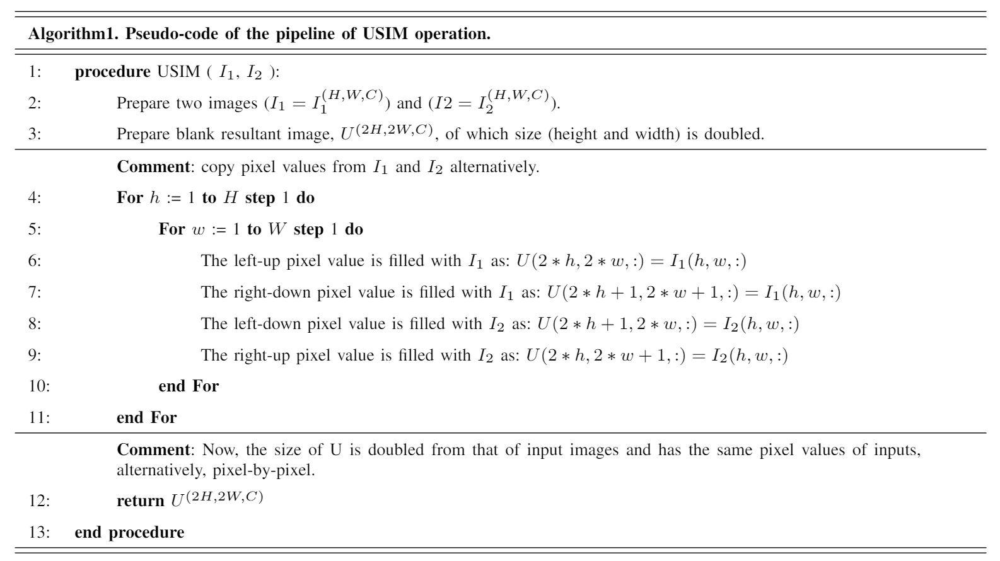
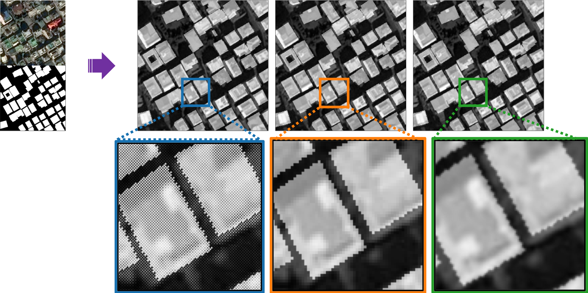
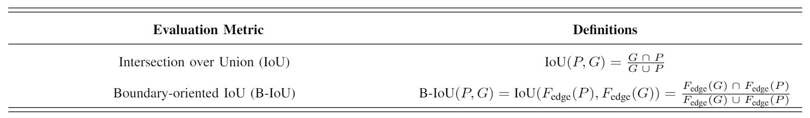
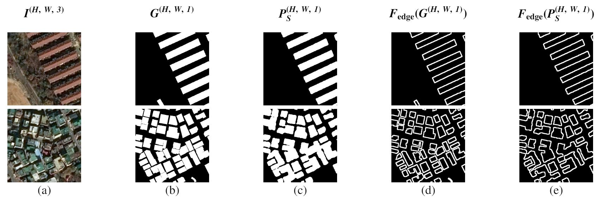
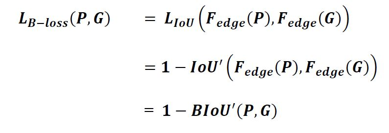
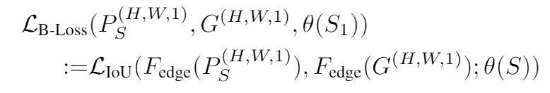
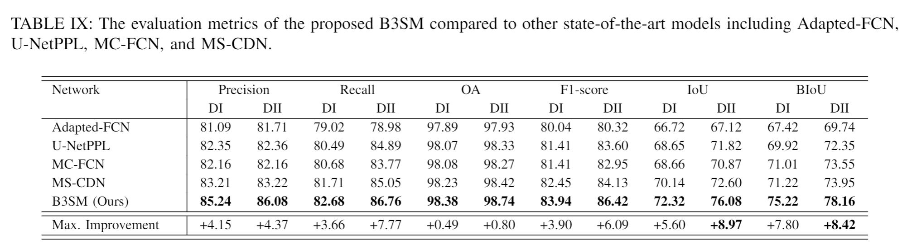
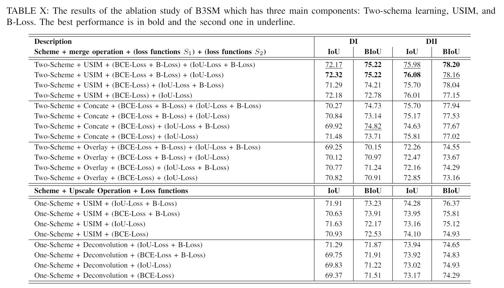
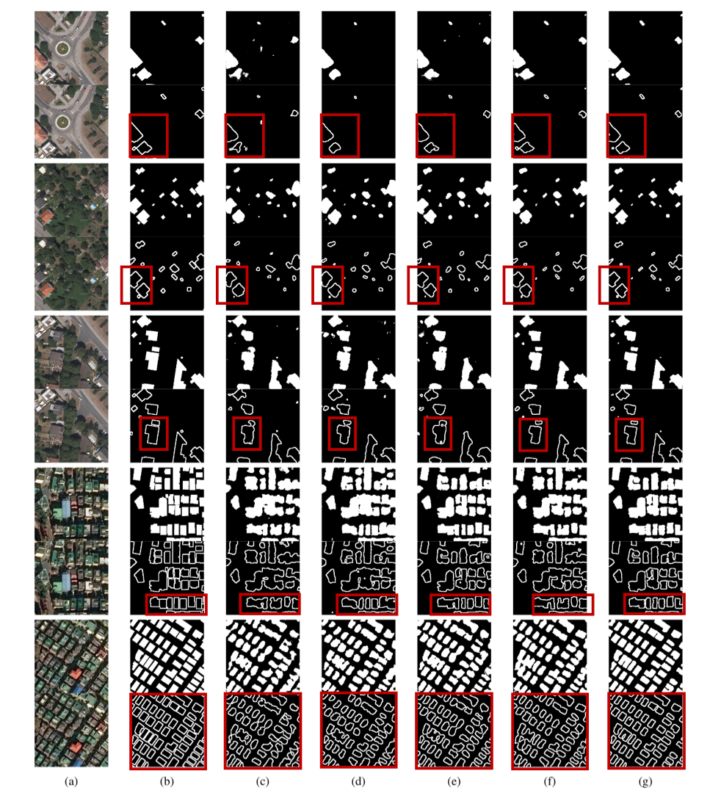

## Contents
  * [Preparations](#preparations)
  * [Run B3SM](#run-b3sm)
  * [Boundary-Oriented Binary Building Segmentation Model (B3SM)](#boundary-oriented-binary-building-segmentation-model-b3sm)
    + [B3SM](#a-boundary-oriented-binary-building-segmentation-model-b3sm)
    + [UpSampling Interpolation Method (USIM)](#b-usim)
    + [Boundary Intersection over Union (B-IoU)](#c-boundary-oriented-intersection-over-union-b-iou)
    + [Boundary Loss Function (B-Loss)](#d-boundary-oriented-loss-function-b-loss)
  * [Paper](#paper-boundary-oriented-binary-building-segmentation-model-with-two-scheme-learning-for-aerial-images)

[[Paper-TBD]](https://github.com/Kyungsu-Lee/B3SM.git) [[Code]](implementations/B3SM.py)
<br>
<br>

## Preparations
### Download Codes
    $ git clone https://github.com/Kyungsu-Lee/B3SM
    $ cd B3SM/
    $ sudo python -m pip install -r requirements.txt


### Download Pre-Trained Weights
[[Download Link]](https://drive.google.com/file/d/1eTp0szyMrUbsE56-kTr6rklojZ8achXj/view?usp=sharing)

    $ Download from Google Drive [https://drive.google.com/file/d/1eTp0szyMrUbsE56-kTr6rklojZ8achXj/view?usp=sharing]
    $ save file in B3SM/weights
    $ tar -xvf Weights.tar

<br>

## Run B3SM

#### Run Example (Training)
```
$ python3 main_train.py 
$ or
$ python3 main_train.py --h
```

#### Run Example (Test)
```
$ python3 test.py
$ or
$ python3 main_test.py --ip [Image_Path] --ap [Annotation Path] --mp [Model Structure Path] --wp [Weights Path]
```
<br>
<br>

## Boundary-Oriented Binary Building Segmentation Model (B3SM)

### A. Boundary-Oriented Binary Building Segmentation Model (B3SM)
[[Code]](implementations/B3SM.py)

The figure illustrates the pipeline of the proposed B3SM. The B3SM uses a modified FusionNet as a baseline architecture for two-scheme learning. For the B3SM, we developed B-Loss to derive more accurate shapes for segmented buildings in aerial images. Additionally, the USIM was designed as a connection between the first and second schemes, as well as the decoder of the second scheme. The key sub-parts of B3SM are in detail: (1) Two-scheme learning; (2) B-Loss; (3) USIM.

<p align="center">
    
</p>
Structure of B3SM of which the baseline architecture is a modified FusionNet.


##

### B. USIM
[[Code]](util/layers/usim.py)

The USIM is an operator for extracting features from the boundaries of buildings in aerial images. This table summarizes Python-based  pseudo code for the USIM operator. The USIM operator takes two input images and generates one merged image by merging and upsampling the input images.
<p align="center">
    
</p>

Output images of the USIM (left), nearest-neighbor interpolation (middle), and bi-cubic interpolation operations (right). The blue solid rectangular indicates the output image of USIM.  The orange and green solid rectangular indicate the output images of  nearest-neighbor interpolation and  bicubic interpolation, respectively.
<p align="center">
    
</p>
<p align="center">
    
</p>

##


### C. Boundary-Oriented Intersection over Union (B-IoU)
[[Code]](implementations/evaluation_metric.py)

Evaluation metrics and their definitions. The P and G indicate the binarized images of Prediction and GroundTruth, respectively.
<p align="center">
    
</p>

F<sub>edge</sub> indicates the function that reveals the edges of buildings, and is defined by F<sub>dilation</sub> ◦ F<sub>Canny</sub> ◦ F<sub>erosion</sub>. Here, Canny edge detection with a monotone gradient condition, 127 as a minimum threshold, 255 as a maximum threshold, and 3 as an aperture size are utilized. In addition, the dilation and erosion filters of which size is 3x3 and values are 3 are utilized to calculate F<sub>edge</sub> with two iterations.

<p align="center">
    
</p>
Example images for evaluation of an IoU value, a B-IoU value, and pixel accuracy. (a) Input image, (b) Ground truth, (c) Prediction, (d) Edge-detected ground truth, and (e) Edge-detected prediction.

##


### D. Boundary-Oriented Loss Function (B-Loss)
[[Code]](implementations/loss_functions.py)

Evaluation metrics and their definitions. The P and G indicate the binarized images of Prediction and GroundTruth, respectively.
<p align="center">
    
</p>

We designed B-Loss to achieve more accurate shapes for buildings in the segmentation of aerial images. The B-Loss function allows pixel values near boundaries to affect the optimization of trainable variables during the training of a deep learning architecture. To develop this loss function, we adopted the characteristics of a linear function.
<p align="center">
    
</p>


<br>
<br>

## [PAPER] Boundary-Oriented Binary Building Segmentation Model with Two Scheme Learning for Aerial Images

#### Authors
Kyungsu Lee, Junhee Kim, Haeyun Lee, Juhum Park, Jihwan Choi, and Jae Youn Hwang*

#### Abstract
Various deep learning-based segmentation models have been developed to segment in aerial images. However, the segmentation maps predicted by the conventional convolutional neural network-based methods cannot accurately determine the shapes and boundaries of segmented buildings. In this paper, to improve the prediction accuracy for the boundaries and shapes of segmented buildings in aerial images, we propose the Boundary-oriented Binary Building Segmentation Model (B3SM). To construct the B3SM for boundary-enhanced semantic segmentation, we present a two-scheme learning, which uses the UpSampling Interpolation Method (USIM) as a new operator, and a Boundary-oriented Loss function (B-Loss). In Scheme I, a raw input image is processed and transformed into a pre-segmented map. In Scheme II, the pre-segmented map from Scheme I is transformed into a more fine-grained representation. To connect these two schemes, we use the USIM operator. Additionally, the novel B-Loss function is implemented in B3SM to extract the features of the boundaries of buildings effectively. To perform quantitative evaluation of the shapes and boundaries of segmented buildings generated by B3SM, we develop a metric called the boundary-oriented intersection over union (B-IoU). After evaluating the effectiveness of two-scheme learning, USIM, and B-Loss for building segmentation, we compare the performance of B3SM to those of other state-of-the-art methods using a public dataset and custom dataset both. The experimental results demonstrate that the B3SM outperforms other state-of-the-art models, resulting in more accurate shapes and boundaries for segmented buildings in aerial images.

#### Experimental Results

<p align="center">
    
</p>

Table IX summarizes the quantitative analysis results for the B3SM, Adapted-FCN, U-NetPPL, MC-FCN, and MS-CDN. The B3SM improves the IoU values by as much as 5.60% and 8.97% for Datasets I and II, respectively, indicating that the proposed B3SM generates better shapes for buildings compared to the other state-of-the-art models. Similarly, the B-IoU values of B3SM are improved by as much as 7.8% and 8.42% for Datasets I and II, respectively, compared to the other state-of-the-art models. The improved B-IoU and IoU values of the B3SM indicate that the B3SM predicts the boundaries and shapes of buildings in aerial images more accurately.
<p align="center">
    
</p>

In order to evaluate the effectiveness of proposed components in B3SM, we performed an ablation study for the two-scheme learning, USIM, and B-Loss. Table X illustrates the results of the ablation study for B3SM. Here, FusionNet is utilized as the baseline architecture. In two-scheme learning, the basic architecture of FusionNet is utilized as the first baseline architecture in S1, and the modified FusionNet of which all deconvolution operations are replaced by USIM is utilized in the second architecture of S2. On the contrary, in one-scheme learning, FusionNet with the illustrated upscale operation is utilized. All deconvolution operations in the decoder part of FusionNet are replaced by USIM and other upscale operations for one-scheme learning. The ablation study demonstrates that the performance of B3SM is improved by three main components; two-scheme learning, USIM, and B-Loss. Two-scheme learning improved IoU and B-IoU values in most cases, especially when it utilized with USIM and B-Loss. USIM outperformed than other merge operations with two-scheme learning as well as offered the higher evaluation scores than other deconvolution operations which are used in one-scheme learning. B-Loss improved the B-IoU in most cases, but the utilization of B-Loss in the second  scheme (S2) somewhat reduces an IoU value while increasing an B-IoU value.


<p align="left">
    
    Segmentation result by our proposed architecture and other state-of-the-art models. (a) Raw image; (b) Ground truth; (c) Adapted-FCN; (d) U-NetPPL; (e) MC-FCN; (f) MS-CDN; (g) B3SM (ours). Significant changes can be found in areas with red rectangles.
</p>

<br>
This figure presents segmented results for the B3SM and the other state-of-the-art models discussed above. The B3SM provides enhanced building segmentation with accurate boundaries. In contrast, the prediction results of the other state-of-the-art models contain scattered noise in their backgrounds and unclear building boundaries based on the close proximity of the buildings. In particular, unclear boundaries of buildings are more likely to be observed in the results obtained using the Adapted-FCN and UNetPPL models. These results demonstrate that the B3SM can clearly distinguish the boundaries of segmented buildings by dividing different buildings and can also reconstruct accurate shapes for the segmented boundaries of buildings. These experimental results demonstrate that the B3SM outperforms the other deep learning architectures for building segmentation, resulting in more accurate shapes and boundaries for segmented buildings in aerial images. 
